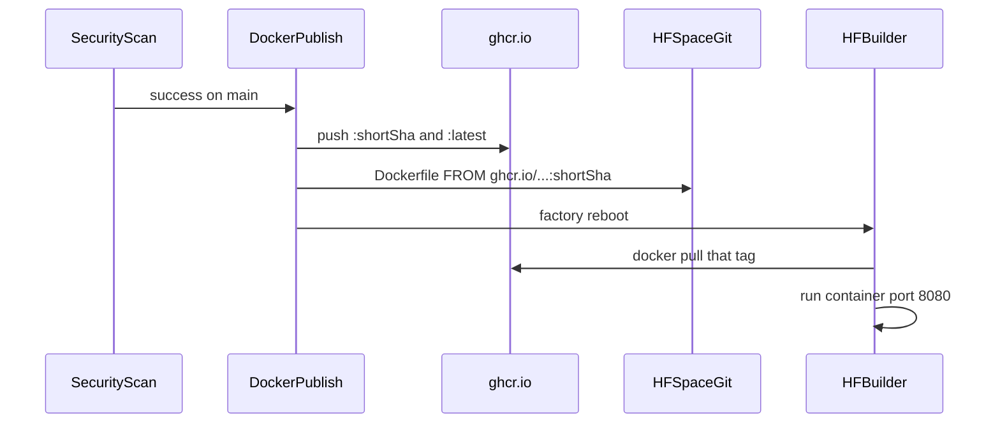

```mermaid
sequenceDiagram
    participant Scan as SecurityScan
    participant GHA as DockerPublish
    participant GHCR as ghcr.io
    participant Hub as HFSpaceGit
    participant Build as HFBuilder

    Scan->>GHA: success on main
    GHA->>GHCR: push :shortSha and :latest
    GHA->>Hub: Dockerfile FROM ghcr.io/...:shortSha
    GHA->>Build: factory reboot
    Build->>GHCR: docker pull that tag
    Build->>Build: run container port 8080
```
