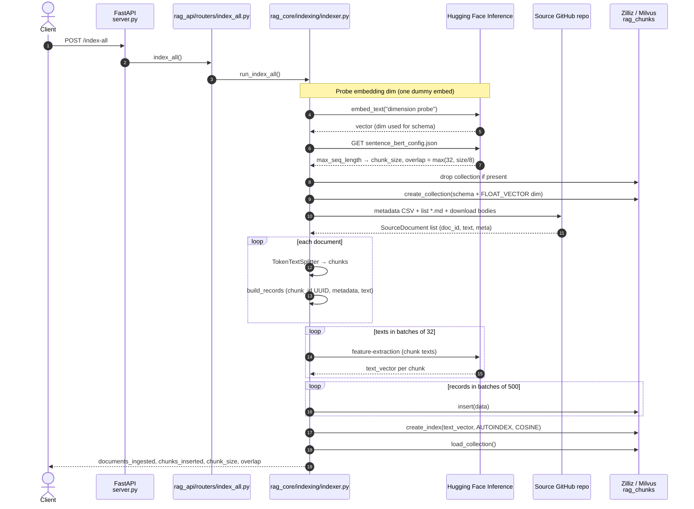
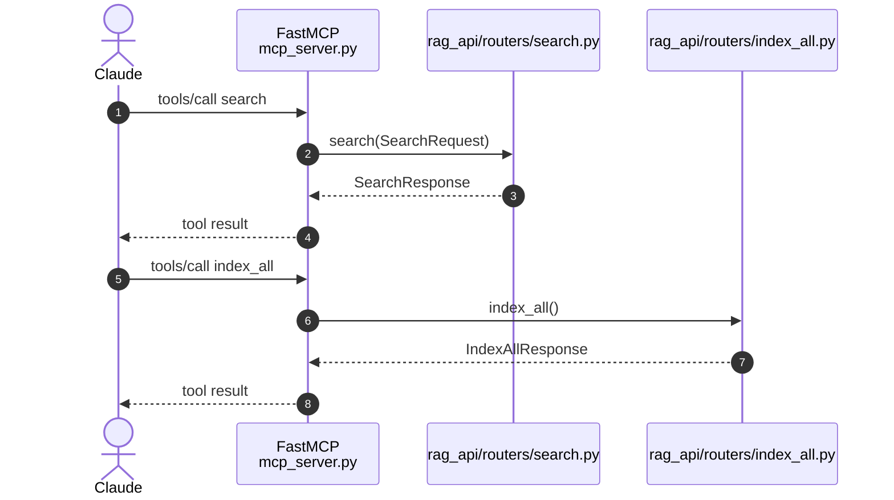
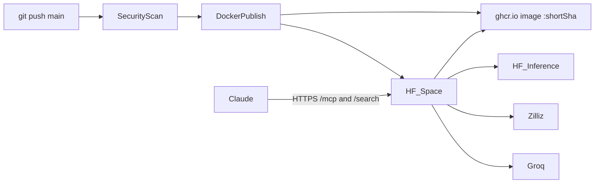

# How this RAG is implemented (`impl/`)

Two HTTP endpoints do the real work. MCP tools `search` and `index_all` call the same routers (`mcp_server.py`, mounted at `/mcp`). `POST /index-doc` is a stub and is not shown.

Default models (env / `generation_config.json` can override):

| Step | Code | Model / engine |
|---|---|---|
| Chunk | `rag_core/indexing/chunking.py` — LlamaIndex `TokenTextSplitter` | No LLM. Size = embedder `max_seq_length` |
| Embed | `rag_core/common/embeddings.py` — HF Inference | `sentence-transformers/all-MiniLM-L6-v2` |
| Store / search | `pymilvus` → Zilliz collection `rag_chunks` | AUTOINDEX, COSINE |
| Rerank | `rag_core/retrieval/rerank.py` — HF Inference | `cross-encoder/ms-marco-MiniLM-L-6-v2` |
| Generate | `rag_core/retrieval/generation.py` — Groq | `openai/gpt-oss-20b` |

---

## 1. Index — `POST /index-all`

Destructive: drops `rag_chunks` if it exists, then rebuilds from the GitHub source repo.



---

## 2. Query — `POST /search`

Live path: embed the question → recall a wider candidate set from Zilliz → cross-encoder rerank to `top_k` → optional Groq answer grounded in those chunks.

Request: `{ "query", "top_k": 5, "generate_answer": true }`.

```mermaid
sequenceDiagram
    autonumber
    actor Client
    participant API as FastAPI<br/>server.py
    participant SearchAPI as rag_api/routers/search.py
    participant Retrieve as rag_core/retrieval/search.py<br/>retrieve_chunks()
    participant Embed as embeddings.py
    participant HF as Hugging Face Inference
    participant Zilliz as Zilliz / Milvus
    participant Rerank as rag_core/retrieval/rerank.py
    participant Gen as rag_core/retrieval/generation.py
    participant Groq as Groq Chat Completions

    Client->>API: POST /search {query, top_k, generate_answer}
    API->>SearchAPI: search(request)
    SearchAPI->>Retrieve: retrieve_chunks(query, top_k)

    Retrieve->>Embed: embed_text(query)
    Embed->>HF: feature-extraction (same MiniLM as index)
    HF-->>Retrieve: query vector

    Note over Retrieve: candidate_k = max(RERANK_CANDIDATES, top_k)<br/>default 8 when RERANK=true

    Retrieve->>Zilliz: search(vector, limit=candidate_k, filter is_active==true)
    alt collection not loaded (Zilliz auto-release)
        Retrieve->>Zilliz: load_collection()
        Retrieve->>Zilliz: search(...) again
    end
    Zilliz-->>Retrieve: hits (score = cosine distance + entity fields)

    alt RERANK=false or no hits
        Retrieve-->>SearchAPI: first top_k in vector order
    else rerank
        Retrieve->>Rerank: rerank_chunks(query, hits, top_n=top_k)
        Rerank->>HF: cross-encoder pairs [query, chunk.text]
        HF-->>Rerank: scores
        Note over Rerank: keep vector_score, set score = rerank_score,<br/>sort desc, slice top_k
        alt HF rerank fails
            Rerank-->>Retrieve: exception
            Retrieve-->>SearchAPI: first top_k in original vector order
        else ok
            Rerank-->>Retrieve: reranked chunks
            Retrieve-->>SearchAPI: results
        end
    end

    alt generate_answer = false
        SearchAPI-->>Client: {query, top_k, results, answer: null}
    else generate_answer = true
        SearchAPI->>Gen: generate_answer(query, chunks)
        Gen->>Gen: load generation_config.json
        Gen->>Gen: user prompt = Context [1..n] (canonical_url + text) + Question
        alt no chunks
            Gen-->>SearchAPI: "No relevant context found..."
        else Groq
            Gen->>Groq: chat.completions (system + user, model/temp/max_tokens)
            Groq-->>Gen: completion (strip optional &lt;think&gt; blocks)
            alt timeout / error / empty
                Gen-->>SearchAPI: fallback: first 3 chunk excerpts
            else ok
                Gen-->>SearchAPI: answer + generation metadata
            end
        end
        SearchAPI-->>Client: {query, top_k, results, answer, generation}
    end
```

---

## 3. MCP — `GET/POST /mcp`

Same process as FastAPI. Tools wrap the routers above; they do not reimplement retrieval.

Hosted URL: `https://harshkumar1-startup-funding-rag.hf.space/mcp`



---

## 4. Deployment (high level)

GitHub holds the source. Actions build `impl/Dockerfile`, push GHCR as `:shortSha` and `:latest`, then pin the Hugging Face Space Dockerfile to that SHA and factory-reboot. The Space does not copy `impl/`; it only `FROM`s GHCR. Runtime secrets are Space env vars. Claude talks to `/mcp` on the Space.

The Space process is not the vector DB or the models. Those stay outside the container:




---

