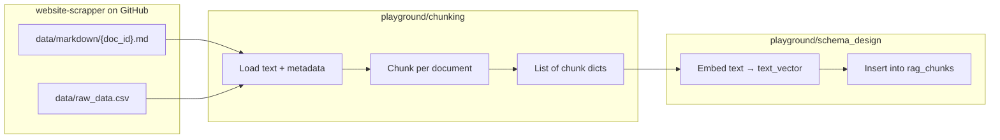

# Integration — Scraper → Chunking → Milvus

How the pieces fit. No stitching code yet — this is the mental model for when you wire it by hand.

## Three stages, three places

| Stage         | Where                          | Job                                |
| ------------- | ------------------------------ | ---------------------------------- |
| **1. Source** | `harshkumar1/website-scrapper` | Pages already scraped              |
| **2. Chunk**  | `playground/chunking`          | Turn page text into ordered chunks |
| **3. Store**  | `playground/schema_design`     | Embed + insert into Zilliz         |

You stitch by **handing the same shape of records** from stage 2 → stage 3.

---

## Important: GitHub has two things; chunking only uses one today

| Path                        | What it is            | Who needs it                           |
| --------------------------- | --------------------- | -------------------------------------- |
| `data/markdown/{doc_id}.md` | Full page **text**    | Chunking (already pulled from GitHub)  |
| `data/raw_data.csv`         | **Metadata** per page | Milvus columns (`base_url`, `lang`, …) |

Filename `0167d8f6-....md` **is** the `doc_id`. That joins markdown ↔ CSV row.

Today chunking loads markdown, joins into one `raw_text`, and compares strategies. It does **not** yet:

- load `data/raw_data.csv`
- keep `doc_id` on each chunk
- emit Milvus-shaped rows

That’s the gap to fill when wiring ingest.

---

## Target record (chunking → schema)

One dict per chunk, ready for insert (`text_vector` filled in the schema notebook):

| Field                 | Source                                               |
| --------------------- | ---------------------------------------------------- |
| `chunk_id`            | `f"{doc_id}#{chunk_order}"` (invented at chunk time) |
| `document_id`         | `doc_id` from filename / CSV                         |
| `chunk_order`         | `0, 1, 2, ...` after split                           |
| `base_url`            | CSV                                                  |
| `canonical_url`       | CSV                                                  |
| `crawl_date`          | CSV `crawl_dt` → epoch int                           |
| `doc_last_modified`   | CSV `doc_last_modified_dt` → epoch int               |
| `content_type`        | CSV (optional: strip charset)                        |
| `content_source_type` | CSV                                                  |
| `scheme_type`         | CSV                                                  |
| `scheme_name`         | CSV                                                  |
| `language`            | CSV `lang`                                           |
| `text`                | this chunk’s string                                  |
| `text_vector`         | filled later (dim from embedder, MiniLM → 384)       |
| `doc_version`         | `str(CSV doc_version)`                               |
| `is_active`           | CSV                                                  |

Chunking owns everything except `text_vector`. Schema notebook owns embed + `client.insert`.

---

## Mental flow when doing it manually

### In chunking notebook (`playground/chunking`)

1. Pull from GitHub: `data/markdown` **and** `data/raw_data.csv` (not markdown alone).
2. Join each `.md` to its CSV row via `doc_id` → `documents` list.
3. Run **exactly one** strategy cell (§8–§11). Each writes to the same variable: **`chunks`**.
4. Run §13 → saves `selected_chunks.json` (download on Colab).

### In schema notebook (`playground/schema_design`)

1. Collection already created (`rag_chunks`).
2. §7 loads `selected_chunks.json` → always gets `chunks`, `doc_id`, `meta` (no edits when you switch strategy).
3. Later: build records, embed (`text_vector` dim from model), insert; add vector index before search.

---

## What not to confuse

- **Chunking experiments** (compare strategies on joined text) ≠ **ingest chunking** (per-doc, keep metadata). Same tools, different purpose.
- Scraper does **not** need to chunk for this plan — you chunk in `playground/chunking`.
- Embeddings do **not** live in the scraper repo — schema / ingest notebook.

---

## Suggested order when copy-pasting

1. Chunking: load CSV + one markdown file → print joined metadata + text length.
2. Chunking: run one splitter → print `chunk_id`, `chunk_order`, `text[:80]` for a few chunks.
3. Schema: insert 1–2 chunks with a dummy or real vector → `query` them back.
4. Then scale to more files / real embedder / search.

---

## Tasks to get this integration working

Checklist in order. Tick these off as you go.

### A. Foundations (done / confirm)

Status as of notebook outputs + repo check:

- [x] Zilliz cluster reachable from Colab (`schema_design_notebook`) — output: `Connected to Zilliz Cloud`
- [x] Collection `rag_chunks` created with the 16-field schema (no indexes required yet for insert) — output: collection listed / described after create
- [x] Scraper data available on GitHub: `data/markdown/` + `data/raw_data.csv` — public repo `harshkumar1/website-scrapper`
- [x] Chunking notebook can download at least one `.md` from GitHub — output: `0167d8f6-....md` saved under `docs_from_github`

**Foundations complete.** Load-source (§B) and shared-`chunks` handoff (§C) are wired in the notebooks. Next: build records + embed/insert (§D).

### B. Chunking notebook — load source correctly (before experiments)

In `chunking_experiments_simple.ipynb` this is **§3–5** (runs before strategy experiments):

- [x] Also download / load `data/raw_data.csv` from the same GitHub repo (not only markdown)
- [x] Join each `.md` to its CSV row via `doc_id` (= filename without `.md`)
- [x] Verify on **one** document: print metadata fields + text length
- [x] Keep a `documents` list (chunk **per document** later — do not merge into one blob for ingest)

### C. Chunking notebook — run ONE strategy → shared `chunks` → schema JSON

1. Run **§8** once (embedding model → `CHUNK_SIZE` = `max_seq_length`, print dim + max seq)
2. Run **exactly one** of §9–§12 (each sets `chunks`)
3. Run §14 to save schema-aligned JSON

Wiring:

- [x] **§8** — `EMBEDDING_MODEL` / `VECTOR_DIM` / `MAX_SEQ_LENGTH` / `CHUNK_SIZE` / `OVERLAP` from model
- [x] **§9–§12** — strategies; token ones use aligned `CHUNK_SIZE`
- [x] **§14** — Colab downloads `selected_chunks.json`; save it to `rag/output/selected_chunks.json` on Mac
- [x] Schema **§8** — Colab uploads that same file into `records`

**§C complete.** Habit: §8 knobs → one strategy (§9–§12) → §14 save → schema notebook loads the JSON as-is.

### D. Schema notebook — embed + insert

- [x] Load `records` from `output/selected_chunks.json` only (no remapping / no print) — §8
- [x] **Embeddings** — §9 sets `text_vector` via `embedder` / `VECTOR_DIM` from §6
- [x] Insert with `client.insert` — §10
- [x] Confirm with `client.query` / peek — §11

**Note:** similarity `search` still needs a vector index (§E).

### E. Indexes + search (after data is in)

- [ ] Create vector index on `text_vector` (e.g. AUTOINDEX + COSINE on Zilliz)
- [ ] Optionally add INVERTED indexes on filter fields (`scheme_type`, `language`, `is_active`, dates)
- [ ] Run a similarity `search` and compare with/without a metadata filter

### F. Scale up

- [ ] Run ingest for more documents (or all of `data/markdown`)
- [ ] Decide overwrite vs upsert strategy when re-crawls bump `doc_version`
- [ ] (Optional later) filter out `is_active=False` / empty text / unparseable URLs at load time

### Out of scope for this stitch (do later if needed)

- Changing website-scrapper to emit chunks itself
- Storing embeddings inside the scraper repo
- Perfect HTML cleanup / real markdown conversion in the scraper

---

## Related paths

- Scraper repo: `https://github.com/harshkumar1/website-scrapper` (`data/markdown`, `data/raw_data.csv`)
- Chunking: `playground/chunking/chunking_experiments_simple.ipynb`
- Schema / Zilliz: `playground/schema_design/schema_design_notebook.ipynb`
- Sample schema reference: `sample/milvus_client.py`

